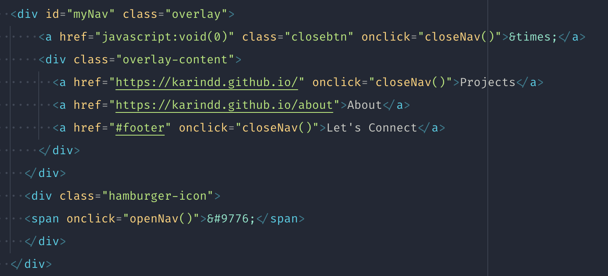
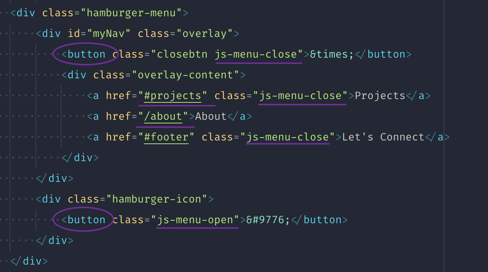
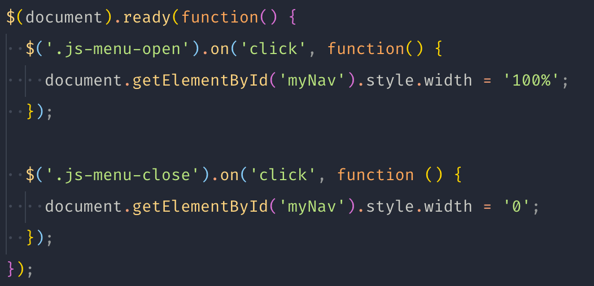
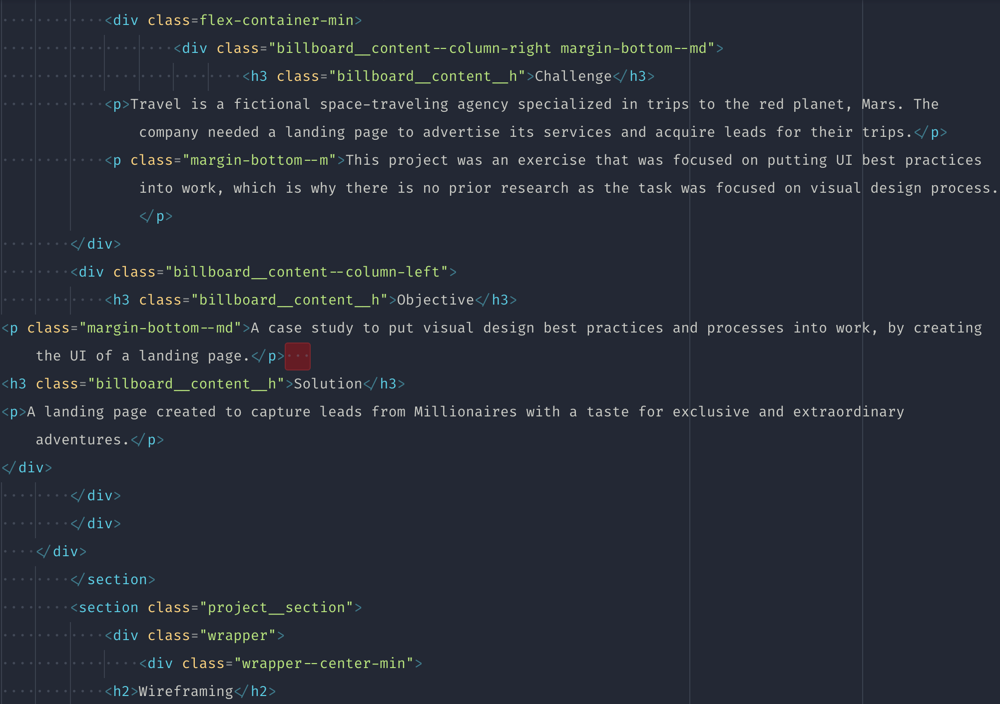
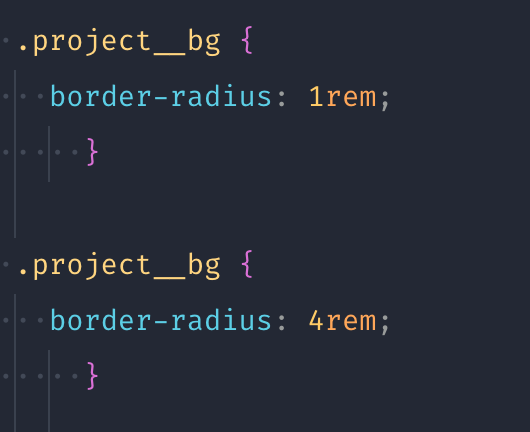
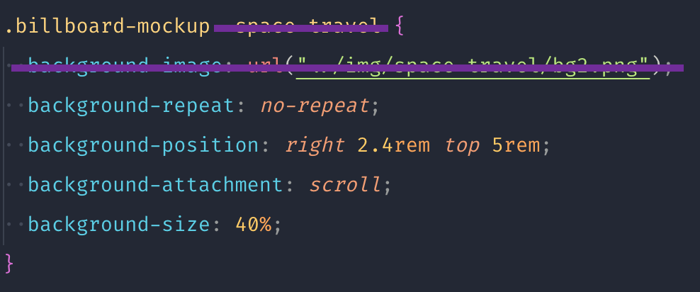
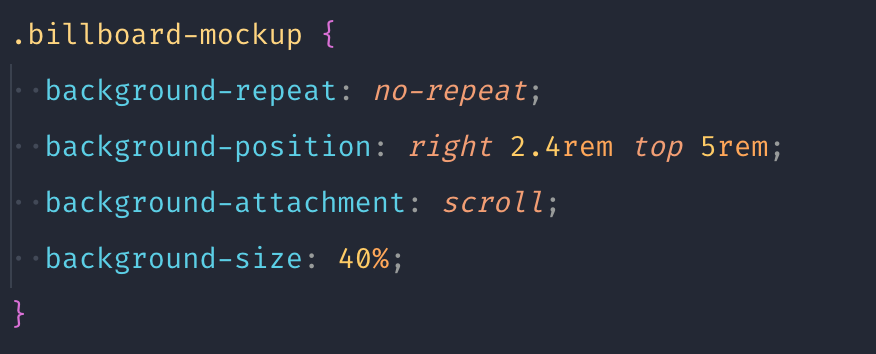
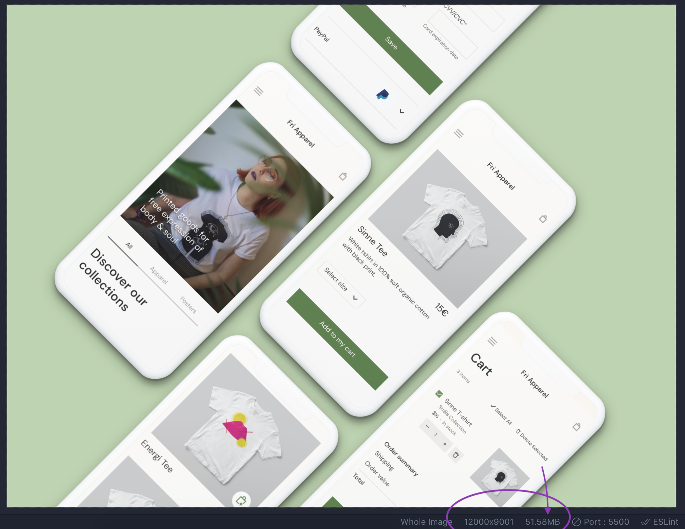

# Review final

Muy buen trabajo Karin! Se nota el trabajo y el tiempo que le has dedicado. Te dejo algo de feedback para que sigas mejorando y afines al máximo tu proyecto. Muy guay el efecto de lectura de la página en los proyectos.

En la navegación de la página creo que puedes mejorarlo. Especialmente en lo que es delegación de funcionalidades. Lo que has hecho no está mal, pero yo considero que el Javascript se debería controlar en su archivo correspondiente (`app.js`) y no dentro del HTML.



Yo haría lo siguiente en este código:

- Indentar bien todos los elementos, sino es muy fácil que cometas un error de cierre de etiqueta
- Modificar las urls para que no tengan dependencia del dominio (https://karindd.github.io), sino de la raíz del proyecto, de esta manera si añades tu dominio personalizado (https://karindd.com) no tienes que modificar nada. Esto lo haría para todo el site.
- Convertiría los `<a>` y `<span>` a `<button>`, ya que semánticamente tiene más sentido que sean botones
- Eliminaría todos los `onClick` del HTML y les añadiría una clase que luego relacionaría en el Javascript. De esta manera, si no quiero aplicar esa función, solo lo elimino del `app.js`



Y tu `app.js` quedaría de la siguiente manera



Aunque ya lo mencioné, ten cuidado con la indentación, mira este ejemplo en donde es complicado analizar el código y es muy fácil de cometer errores. Tampoco es algo grave, pero tu código quedará mucho mejor y de cara a alguien técnico es mucho más vistoso.



Hay plugins que te ayudan a esto para mantener una coherencia en todo tu código. El mejor es [Prettier](https://marketplace.visualstudio.com/items?itemName=esbenp.prettier-vscode), que funciona para muchos lenguajes. Lo guay de este es que puedes configurarlo para que te formatee el código en cuanto le das a guardar.

En cuanto al css, veo que has utilizado muy bien varios elementos y has organizado bien el código, pero he visto que se repiten algunos elementos y otros que se pueden optimizar para que puedas reutilizarlos sin tener que crear una clase para cada elemento.

Por ejemplo, aquí repites el código y la primera de las clases no se cumple, ya que la siguiente la sobreescribe, esto hace que tu archivo crezca de peso innecesariamente o te pueda hacer equivocar.



Luego, utilizas algunos estilos que podrías reaprovechar combinando con el atributo `style` de HTML. Por ejemplo:



Si eliminas la imagen y pones un nombre de clase más genérico, te quedaría algo como



Y luego, en el HTML, añades la imagen en el `style`

```html
<div class="billboard-mockup" style="background-image: url(../img/space-travel/bg2.png);">
    ...
</div>

<div class="billboard-mockup" style="background-image: url(../img/otra-imagen.png);">
    ...
</div>
```

En cuanto a las imágenes, ten en cuenta el tamaño, varias de ellas pesan bastante y harán más lenta tu página. En principio no deberían pesar más de 300/400 KB (las imágenes grandes) o por lo menos, menos de 1MB (si son muy grandes). Actualmente tienes varias imágenes de varios megas, tienes [algunas opciones online](https://tinypng.com/) para optimizarlas.


